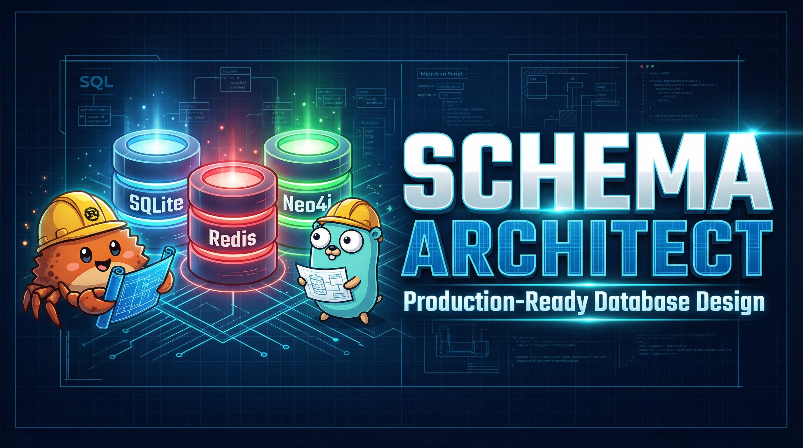

<div align="center">

</div>

# schema-architect

Design and generate production-ready database schemas for SQLite, Redis, and Neo4j. Includes type-safe Rust and Go bindings, versioned migrations, a validation script, and enterprise patterns for both early-stage and scaled systems.

Works with Claude Code, Cursor, Codex CLI, and any agent that supports the agentskills protocol.

## Install

```bash
npx skills add OthmanAdi/schema-architect -g
```

Then just describe what you're building. The skill picks up on phrases like "design a schema", "set up Redis caching", "generate ORM models in Rust", or "architect a multi-database system" and takes it from there.

## What it does

You tell it your domain, stack, and where you are in the project (MVP or production-scale). It asks four questions:

- Stage: `early` or `advanced`
- Databases: any combination of SQLite, Redis, Neo4j
- Language: Rust, Go, or both
- Domain: what the app actually does

Then it generates everything: SQL schemas, Redis key configs, Cypher constraints, language bindings, and versioned migrations. A Python validation script checks the output for naming inconsistencies, missing indexes, and migration ordering problems.

## What gets generated

For SQLite:
- `schema.sql` with normalized tables, FK indexes, audit columns
- Versioned migration files in `migrations/` with up and down sections

For Redis:
- `redis-schema.toml` with namespaced keys and TTL policies

For Neo4j:
- `constraints.cypher` and `schema.cypher`

For Rust:
- `models.rs`, `db.rs`, `cache.rs`, `graph.rs` using sqlx, redis-rs, neo4rs

For Go:
- `models.go`, `db.go`, `cache.go`, `graph.go` using database/sql, go-redis, neo4j-go-driver

## Example

> "Design a schema for a SaaS task management app. SQLite and Redis, Rust bindings, early stage."

The skill clarifies the domain, confirms defaults, then generates normalized tables with FK indexes and audit columns, a Redis key structure for sessions and rate limiting, connection pool setup, and a repository pattern in Rust. It runs the validator and reports any issues before finishing.

## Two modes

**Early stage** uses SQLite as the primary store with Redis for sessions and rate limiting. Neo4j only gets added when the data actually has graph characteristics. The output is simple, embeddable, and easy to run locally.

**Advanced stage** adds multi-tenancy, CQRS, event sourcing via Redis Streams, graph access control in Neo4j, and audit trails. More files, more structure, built for teams.

## Files in this repo

```
schema-architect/
  SKILL.md
  scripts/
    validate_schema.py
  references/
    sqlite.md
    redis.md
    neo4j.md
    rust-bindings.md
    go-bindings.md
    naming-conventions.md
    migration-patterns.md
    integration-patterns.md
  templates/
    sqlite-migration.sql.tmpl
    redis-schema.toml.tmpl
    neo4j-constraints.cypher.tmpl
    rust-model.rs.tmpl
    go-model.go.tmpl
```

The skill reads reference files on demand, so it doesn't load everything into context upfront. It pulls `sqlite.md` when it's working on SQLite, `rust-bindings.md` when generating Rust code, and so on.

## Rules enforced on all generated output

- Tables normalized to 3NF minimum
- Every foreign key gets an index
- `created_at` and `updated_at` on every table, UTC only
- Redis keys namespaced as `{service}:{entity}:{id}:{field}`
- Neo4j relationships are verbs: `FOLLOWS`, `PURCHASED`, `BELONGS_TO`
- Migrations are immutable. Never edit a deployed one.

## Author

Ahmad Othman Ammar Adi -- [OthmanAdi](https://github.com/OthmanAdi)

[](https://getskillcheck.com)
